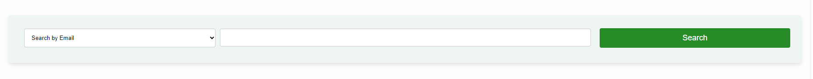
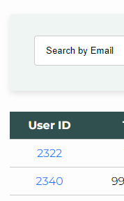
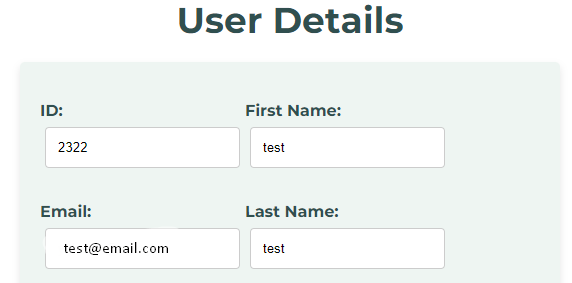
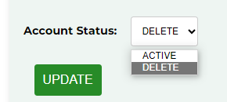

# SearchAndUpdateFromSQLServer
Using Flask, this application can execute SELECT statements to get data from tables in SQL Server as well as UPDATE statements to change existing data.

### The index.html page implements functionality to look up account information by matching on email address:

 

### Once an email is passed to the search function in index.html, the executed query outputs associated account details:

 

### Once a user ID is selected, the update.html page renders and populates with the account data for the chosen user ID as in the screen shot below:

 

### The update.html page also provides functionality to modify and save changes to the user's account information:

 
